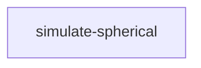

# GRGG: Generalized Random Geometric Graphs

This is a Python package for studying Generalized Random Geometric Graphs (GRGGs). They generalize the classical [Random Geometric Graphs (RGGs)](https://en.wikipedia.org/wiki/Random_geometric_graph) by allowing for more flexible rules of connecting nodes based on their positions in an underlying (compact) metric space, in particular by supporting both hard (deterministic) and soft (probabilistic) connections as well as similarity (implicitly used in RGGs) and complementarity kernel functions, including combinations thereof. Moreover, they are based on a flexible parametrization which contains both hard (determinstic) RGGs and Erdős-Rényi (ER) random graphs as special cases. The mathematical framework can be also extended to include node-specific fitness parameters, which can be used to control the expected degree of individual nodes, allowing to generate graphs with arbitrary degree distributions, including scale-free graphs, meaning that the family of GRGGs can be seen as also including configuration models and hyperbolic geometric graphs as special cases. Refer to the [theory](#theory) for more details.

The package provides tools for specifying GRGG models with some desired properties (e.g. a specific average degree) and memory-efficient sampling of graph instances from these models.

```python
# Create a GRGG model for 1000 nodes on a sphere with average degree of 10
# and eqiuvalent to the classical (hard) Random Geometric Graph (RGG)
# defined on the surface of a 2D sphere
import numpy as np
from grgg import GRGG, Similarity

model = GRGG(1000, 2).add_kernel(Similarity, beta=np.inf).calibrate(10)

# Sample a graph instance from the model and get an 'igraph.Graph' instance
# to check that indeed the global clustering is high (as expected for RGGs)
sample = model.sample()
sample.G.transitivity_undirected()

# See more examples in the docstring:
help(GRGG)
```

**NOTE.** This repository provides a Python package, which probably will not be published on PyPI but can be installed directly from GitHub, as well as additional code, configuration, scripts and notebooks used for generating figures and results for the associated publication:

- TODO

## Installation

For now there are no plans to publish this package on PyPI, so installation is done directly from the [GitHub repository](https://github.com/sztal/grgg).

```bash
pip install git+ssh://git@github.com/sztal/grgg.git
# From a specific branch, e.g. 'dev'
pip install git+ssh://git@github.com/sztal/grgg.git@dev
```

## Basic usage

Refer to the [theory](#theory) to have a better understanding of the meaning of the following examples, including the parameters used.

Here, we will create a simple probabilistic Random Geometric Graph (RGG). The framework of GRGGs is compositional, so the definition starts with a specification of the number of nodes and the metric space in which the nodes will be embedded. Then, one or more kernel functions are added to define the connection rules translating from relative positions of pairs of nodes to corresponding edge probabilities. Additionally, the model may be calibrated to achieve a desired expected average degree.

**NOTE.** To allow for relational principles other than similarity, GRGGs must be defined on compact metric spaces such as (hyper)spheres or tori or finite Euclidean boxes. **Currently, only spheres are implemented.**


```python
from grgg import GRGG, Similarity

# Basic model definition
# 100 nodes on a sphere with 2D surface
model = GRGG(100, 2)
# Add similarity (proximity-based) kernel
# with soft (probabilistic) connections
model.add_kernel(Similarity, beta=5.0)
# Calibrate the model to have expected average degree of 10
model.calibrate(10)
# Check theoretical expected average degree
model.kbar # should be close to 10
# Sample a graph instance from the model
sample = model.sample()
# Get an adjacency matrix (sparse) and check the average degree
sample.A.sum(axis=1).mean() # should be close to 10

# Sample objects contain also sampled node positions, useful for plotting
sample.X  # shape (100, 3) in our case (the 2-sphere is embedded in R^3)
# and 'igraph.Graph' instances, note the high clustering coefficient!
sample.G.transitivity_undirected()
```

Most importantly, a model can contain multiple kernels, including both similarity-based and complementarity-based ones. A question that arises naturally in this context is whether one should calibrate the kernel parameters to kernel specific expected average degrees or to a global expected average degree. Both approaches are supported.

```python
from grgg import GRGG, Similarity, Complementarity
# Calibrate two krnels independently
# Note the first parameter of the 'add_kernel' method
model = (
    GRGG(100, 2)
    .add_kernel(5, Similarity)
    .add_kernel(5, Complementarity)
)
model.kbar
# This can be grater thatn the sum of the two kernel degrees
# due to the overlap of edges generated by the two kernels

# To calibrate the kernel globally use the 'calibrate' method
model = model.calibrate(10)
model.kbar  # should be close to 10 now

# Crucially, one can use different weights for kernels
# Here the complementarity kernel is weighted two times more
model = model.calibrate(10, weights=[1, 2])
# Let us check the expected average degree in the submodels
model[0].kabr # similarity kernel, should be close to 10/3
model[1].kbar # complementarity kernel, should be close to 20/3
```

### Manifolds

Currently, only spheres are implemented. The dimension of the sphere is specified when creating the `GRGG` model. For example, `d=2` corresponds to the 2-sphere (surface of a 3D ball) embedded in `R^3`, while `d=1` corresponds to the 1-sphere (circle) embedded in `R^2`. By default, the manifolds are initialized to have surface area equal to the number of nodes, so the area per node is independent of the system size.

However, one can initialize models using a custom sphere object to allow for more flexibility, e.g. to change the radius of the sphere. The model will determine the implied (uniform) sampling density automatically, so the calculations will be consistent regardless of the sphere radius.

```python
from grgg import GRGG, Sphere, Smilarity

# Create a sphere with radius 10
sphere = Sphere(2, radius=10.0)
# Create a GRGG model using the custom sphere
model = GRGG(1000, sphere).add_kernel(10, Similarity)
model.kbar  # should be close to 10
```

## Reproducibility

The computations required to reproduce the results and figures presented in the associated publication are managed using [Data Version Control (DVC)](https://dvc.org/), which organizes the computational pipeline in stages and track their inputs and outputs. The graph of computations can be visualized using the `dvc dag` command and is shown below.



Use `dvc repro` to reproduce all computations or `dvc repro <stage-name>` to reproduce a specific stage.


## Development

### Environment setup and dev installation

```bash
# Clone the repo
git clone git+ssh://git@github.com/sztal/grgg.git
# Or from a specific branch, e.g. 'dev'
git clone git+ssh://git@github.com/sztal/grgg.git@dev
```

Configure the environment and install the package after cloning. The make commands below also set up and configure version control (GIT) and data versioning (DVC).

```bash
cd grgg
conda env create -f environment.yaml  # creates conda env 'grgg'
conda activate grgg
make init
```

`Makefile` defines several commands that are useful during development.

```bash
# Clean up auxiliary files
make clean
# List explicitly imported dependencies
make list-deps
```

### Testing

```bash
pytest
## With automatic debugger session
pytest --pdb
```

### Unit test coverage statistics

```bash
# Calculate and display
make coverage
# Only calculate
make cov-run
# Only display (based on previous calculations)
make cov-report
```


## Theory
